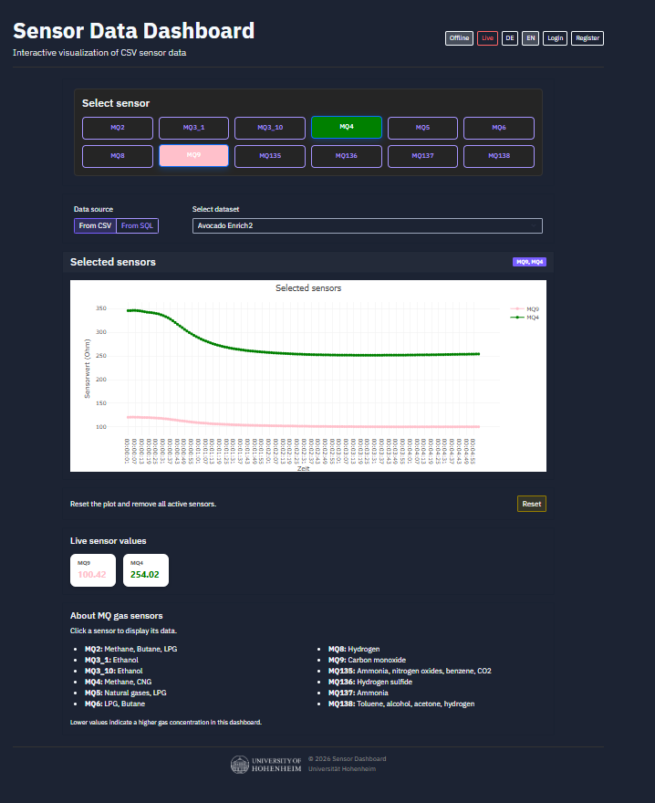
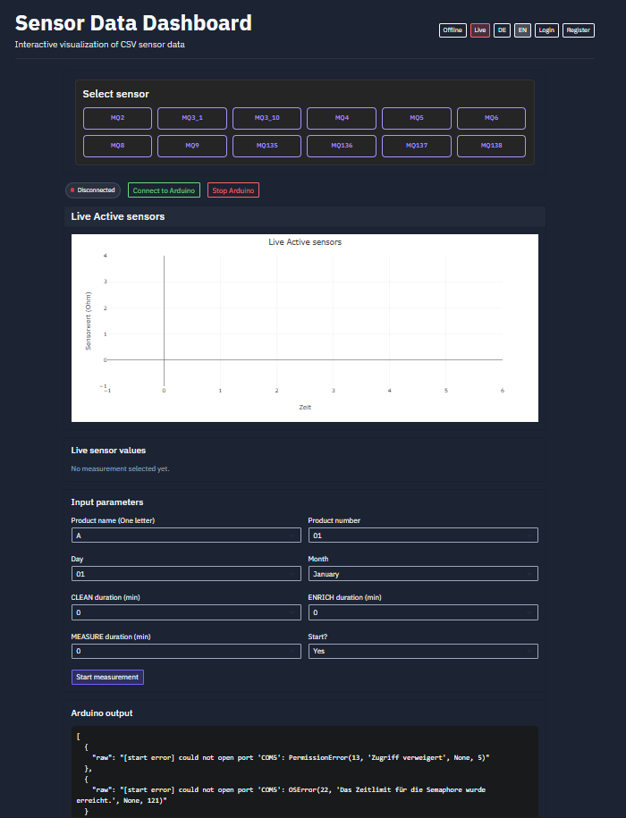
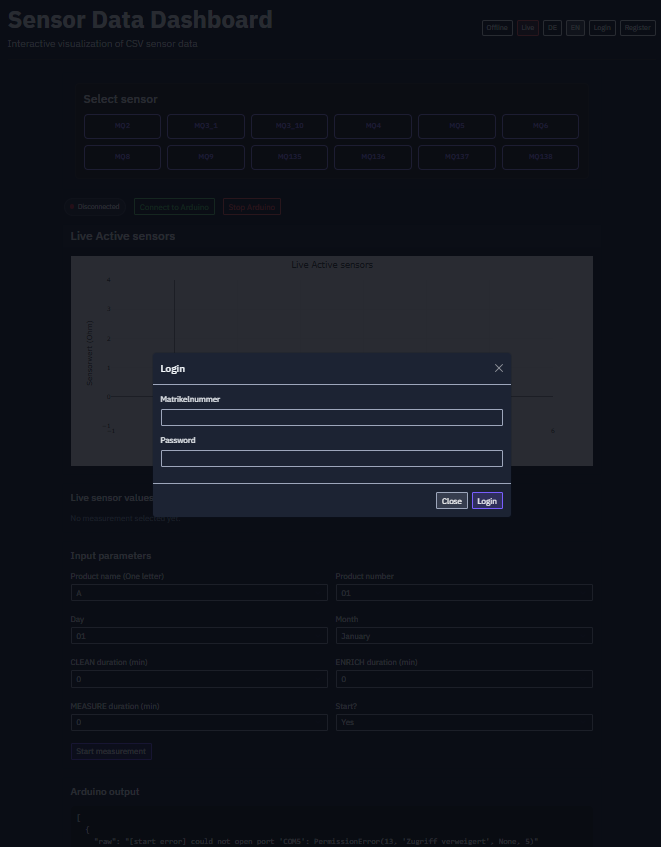

# Sensor Dashboard App

## Screenshots

### Offline Dashboard



### Live Dashboard



### Login



Sensor Dashboard is a full-stack web application for viewing gas sensor data in two modes:

- `Offline`: load historical datasets and plot them on demand
- `Live`: receive sensor output from Arduino or a simulator and plot it as it arrives

The project now uses a React frontend and a Flask backend API. The backend also stores data in SQLite and can serve the same dataset either directly from CSV files or from SQL-imported copies.

## Tech Stack

### Frontend

- React
- Vite
- Plotly.js
- Bootstrap

### Backend

- Python
- Flask
- Flask-Login
- Flask-SQLAlchemy
- SQLite
- Pandas
- PySerial

### Data Sources

- CSV files in `data/`
- SQL-backed imported datasets in SQLite
- User measurement CSV files in `persistent_data/measurements/`
- Temporary measurement files in `temp_measurements/`

## What The App Does

The app is built for MQ-series gas sensor data.

Main features:

- Select one or more sensors and plot them
- Switch offline dataset source between `CSV` and `SQL`
- View live sensor streams
- Connect to Arduino and start a measurement
- Save user measurements
- Download and delete saved measurements
- Log in and keep measurements per user

## High-Level Architecture

The system is split into frontend and backend.

### Frontend

The React app lives in `frontend/`.

It is responsible for:

- page layout
- source switcher (`CSV` / `SQL`)
- sensor selection
- plotting with Plotly
- login/register modals
- live polling UI
- measurement management UI

In production, Vite builds the frontend into:

- `static/frontend/`

Flask serves that built app for:

- `/`
- `/live`

### Backend

The Python backend now lives in:

```text
sensor_dashboard/
```

Main backend parts:

- [`sensor_dashboard/app.py`](C:/Users/grigo/projekt_ordner/sensor-dashboard-app/sensor_dashboard/app.py)
  Flask app, API routes, auth wiring, frontend serving
- [`sensor_dashboard/paths.py`](C:/Users/grigo/projekt_ordner/sensor-dashboard-app/sensor_dashboard/paths.py)
  central path definitions
- [`sensor_dashboard/models/`](C:/Users/grigo/projekt_ordner/sensor-dashboard-app/sensor_dashboard/models)
  SQLAlchemy models
- [`sensor_dashboard/services/`](C:/Users/grigo/projekt_ordner/sensor-dashboard-app/sensor_dashboard/services)
  data loading / transformation logic
- [`sensor_dashboard/hardware/`](C:/Users/grigo/projekt_ordner/sensor-dashboard-app/sensor_dashboard/hardware)
  Arduino serial integration

There is also a thin root entrypoint:

- [`app.py`](C:/Users/grigo/projekt_ordner/sensor-dashboard-app/app.py)

That file exists so the app still starts with:

```powershell
.venv\Scripts\python.exe app.py
```

## Project Structure

```text
sensor-dashboard-app/
  sensor_dashboard/
    app.py
    paths.py
    hardware/
      arduino_connect.py
      arduino_read.py
    models/
      __init__.py
      user.py
      dataset.py
    services/
      visualization.py
  frontend/
    src/
    package.json
    vite.config.js
  static/
    css/
    images/
    js/
    frontend/
  data/
  persistent_data/
    db/
    measurements/
  temp_measurements/
  app.py
  requirements.txt
  README.md
```

## How Data Flows Through The App

### 1. Offline CSV flow

1. The frontend asks Flask for available files:
   - `GET /api/available-files?source=csv`
2. The user selects a sensor and a file.
3. The frontend asks:
   - `GET /api/sensor/<sensor_id>?file=<filename>&source=csv`
4. Flask reads the CSV through the visualization service.
5. The frontend receives `time` and `values` arrays and plots them with Plotly.

### 2. Offline SQL flow

1. On startup, Flask imports CSV datasets from `data/` into SQLite.
2. The frontend asks for SQL-backed files:
   - `GET /api/available-files?source=sql`
3. The user selects a sensor and a file.
4. The frontend asks:
   - `GET /api/sensor/<sensor_id>?file=<filename>&source=sql`
5. Flask reads the dataset rows from SQLite instead of from disk.
6. The frontend plots the returned arrays in the same way as CSV mode.

### 3. Live flow

1. Arduino or the simulator produces sensor rows.
2. The backend receives live rows at:
   - `POST /api/live-stream-data`
3. The frontend polls:
   - `GET /api/live-stream-data`
4. The frontend appends points to Plotly traces.

### 4. Measurement save flow

1. The user starts a measurement from the live page.
2. The backend sends prompts/parameters to Arduino.
3. Sensor rows are read from serial and buffered.
4. When measurement end is detected, the backend:
   - writes CSV files
   - stores measurement metadata in SQLite
5. The user can later open, download, or delete those measurements.

## Database

The app uses SQLite.

Database file:

- `persistent_data/db/sensor_dashboard.db`

### Main tables

#### `users`

Stores:

- user id
- matrikelnummer
- password hash
- timestamps

#### `measurements`

Stores:

- measurement filename
- product name
- product number
- date
- created_at
- JSON copy of measurement rows

This is used for user-owned saved measurements.

#### `imported_datasets`

Stores imported copies of CSV datasets from `data/`.

Stores:

- filename
- display name
- source path
- row count
- JSON-serialized rows
- timestamps

This table is what powers the offline `SQL` source switch.

## API Overview

### Frontend/session

- `GET /api/session`
- `POST /api/logout`
- `POST /login`
- `POST /register`

### Offline plotting

- `GET /api/available-files?source=csv|sql`
- `GET /api/sensor/<sensor_id>?file=<filename>&source=csv|sql`

### Live/simulator

- `POST /api/live-stream-data`
- `GET /api/live-stream-data`
- `POST /api/connect_arduino_terminal`
- `POST /api/start_measurement`
- `POST /api/stop_arduino`

### Measurements

- `GET /api/measurements`
- `GET /api/measurements/<id>/data`
- `GET /api/measurements/<id>/download`
- `POST /api/measurements/<id>/delete`

## Important Directories

### `data/`

Default offline datasets shipped with the app.

### `persistent_data/db/`

SQLite database location.

### `persistent_data/measurements/`

Saved user measurement CSV files.

### `temp_measurements/`

Temporary generated CSV measurement files.

### `static/frontend/`

Built React production bundle served by Flask.

## How The Frontend And Backend Connect

The React frontend does not read files or databases directly.

It always talks to Flask over HTTP.

React:

- chooses a view
- calls API endpoints
- receives JSON
- plots or renders UI

Flask:

- authenticates users
- loads CSV files
- loads SQL datasets
- reads/writes SQLite
- talks to Arduino
- returns JSON responses to React

So the connection looks like this:

```text
React UI -> Flask API -> CSV / SQLite / Arduino
```

## Startup And Runtime

### Python setup

```powershell
.venv\Scripts\Activate.ps1
.venv\Scripts\pip.exe install -r requirements.txt
```

### Frontend build

```powershell
cd frontend
npm.cmd install
npm.cmd run build
cd ..
```

### Start the app

```powershell
.venv\Scripts\python.exe app.py
```

Open:

```text
http://127.0.0.1:5000
```

## Development Notes

### Frontend dev server

If you want to work on the frontend separately:

```powershell
cd frontend
npm.cmd install
npm.cmd run dev
```

Vite is configured to proxy backend requests to Flask.

## GitHub Pages Deployment

The repository now includes a workflow at:

- `.github/workflows/pages.yml`

It builds the React app from `frontend/` and deploys `frontend/dist` to GitHub Pages on every push to `main`.

### One-time GitHub setup

1. Open repository settings on GitHub.
2. Go to `Pages`.
3. Set source to `GitHub Actions`.

### Important limitation on Pages

GitHub Pages can only host static files.

This means API-based features (`/api/*`, login/register, live Arduino, SQL/CSV backend endpoints) require the Flask backend to be hosted separately.

The frontend itself is deployable and will load on Pages, but backend-dependent actions will fail unless you provide an external API URL/reverse proxy.

### Backend initialization

On startup, `init_db()` does two things:

1. creates database tables
2. syncs default CSV datasets from `data/` into the `imported_datasets` SQL table

## Current Behavior Notes

- Offline plotting supports both direct CSV reads and SQL-backed reads.
- Live plotting is still polling-based.
- User measurements are tied to authentication.
- The root `app.py` is only a launcher; the real app logic is inside `sensor_dashboard/app.py`.

## Recommended Mental Model

Use this model when reading the project:

- `frontend/` = what the user sees
- `sensor_dashboard/app.py` = API and app wiring
- `sensor_dashboard/services/` = data loading logic
- `sensor_dashboard/models/` = database schema
- `sensor_dashboard/hardware/` = Arduino serial handling
- `sensor_dashboard/paths.py` = filesystem paths

## Troubleshooting

### Frontend says build not found

Build the frontend again:

```powershell
cd frontend
npm.cmd run build
cd ..
```

### Backend import/path issues

The project now expects backend imports to come from `sensor_dashboard.*`.

### Dataset not visible in SQL mode

Restart the backend so startup sync imports datasets from `data/` into SQLite.

### Arduino connection fails

Check:

- cable/port
- serial permissions
- whether the detected port is correct

## Summary

This project is a React + Flask sensor dashboard with:

- offline plotting
- live plotting
- login-based measurement storage
- SQLite-backed metadata and datasets
- a switchable CSV/SQL offline data source
- Arduino integration through serial communication
